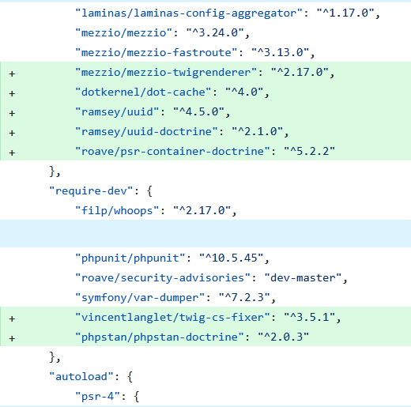
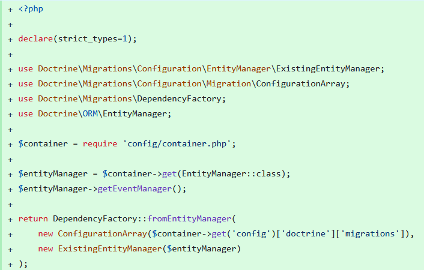
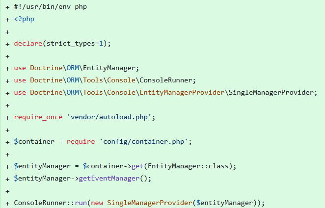
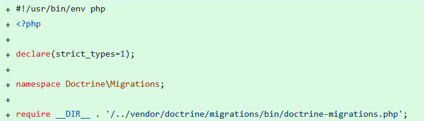

# Installing Doctrine

## Composer Requirements

The first step is to add alongside your current packages the required entries for our Doctrine installation. We would add the following to our `composer.json` file located in our root folder:



`dotkernel/dot-cache`

Provides caching support for DotKernel applications.
It offers a PSR-6 and PSR-16 compatible caching system that integrates smoothly with DotKernel's service container.

`ramsey/uuid`

A widely used PHP library for generating and working with UUIDs (Universally Unique Identifiers).
It supports multiple UUID versions.

`ramsey/uuid-doctrine`

Adds UUID support to Doctrine ORM using ramsey/uuid.
It allows Doctrine to store and retrieve UUIDs as proper value objects instead of plain strings, improving type safety.

`roave/psr-container-doctrine`

Provides a set of factory classes that integrate Doctrine ORM with any PSR-11 container.
It simplifies wiring Doctrine EntityManager, DBAL, configuration, and related services in frameworks like DotKernel.

`phpstan/phpstan-doctrine (dev requirement)`

An extension for PHPStan that improves static analysis for Doctrine.
It understands entity metadata, repositories, and common Doctrine patterns, helping catch errors during development.

## Setting Up Doctrine

After successfully installing our dependencies we now need to configure our Doctrine instance.

### Declare your database

In the file `config/autoload/local.php` the structure would be updated like this:


### Declare the Doctrine Drivers and Migrations Location

With the very nice utility of the package `laminas/laminas-config-aggregator` we can declare our doctrine settings in the `src/App/src/ConfigProvider.php` file.
This package takes all the provided configs from the `config/config.php` file and merges them into one.

Our new `src/App/src/ConfigProvider.php` class would look like this now:


We also require a new file `config/cli-config.php`.
It initializes and returns a `DependencyFactory` that Doctrine Migrations uses to run migrations.



## Running doctrine

Now that everything has been configured we only need to do one last thing, to create an executable for the Doctrine CLI.
In our case we will create it as `/bin/doctrine`



(Optional) To keep things tidy we recommend to make an executable for the migrations of Doctrine as well for example `/bin/doctrine-migrations`:



Now by running the command bellow we should see the Doctrine CLI version alongside its available commands:

```shell
php bin/doctrine
```

Example (truncated) output:

```terminaloutput
Doctrine Command Line Interface 3.5.7.0

Options:
  -h, --help            Display help for the given command. When no command is given display help for the list command
      --silent          Do not output any message
  -q, --quiet           Only errors are displayed. All other output is suppressed
  -V, --version         Display this application version
      --ansi|--no-ansi  Force (or disable --no-ansi) ANSI output
  -n, --no-interaction  Do not ask any interactive question
  -v|vv|vvv, --verbose  Increase the verbosity of messages: 1 for normal output, 2 for more verbose output and 3 for debug
```
