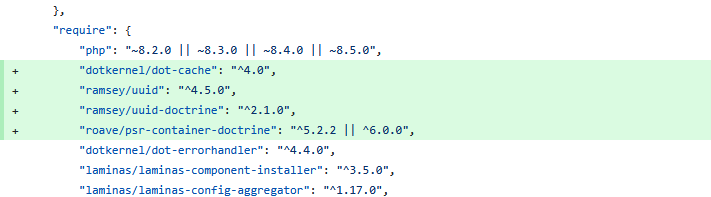
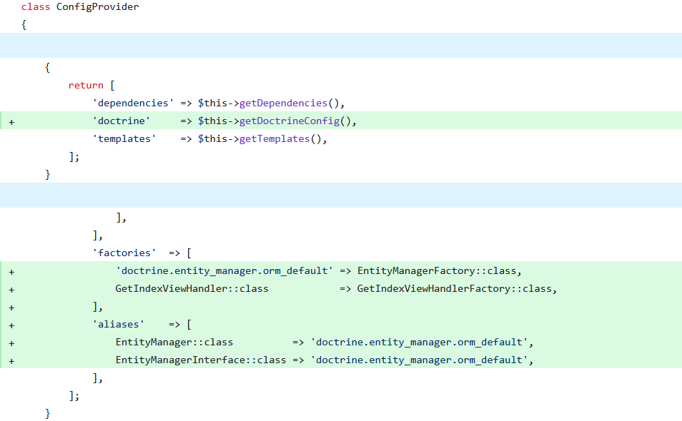
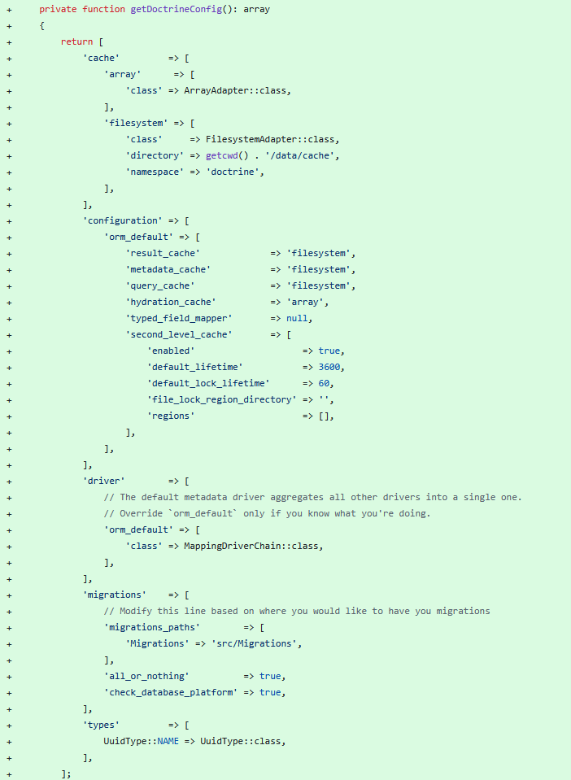
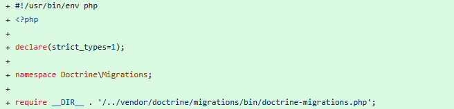

# Installing Doctrine

## Composer Requirements

The first step is to add alongside your current packages the required entries for our Doctrine installation.
We would add the following to our `composer.json` file located in our root folder:



```text
"dotkernel/dot-cache": "^4.0",
"ramsey/uuid": "^4.5.0",
"ramsey/uuid-doctrine": "^2.1.0",
"roave/psr-container-doctrine": "^5.2.2 || ^6.0.0",
```

`dotkernel/dot-cache`

Provides caching support for DotKernel applications.
It offers a PSR-6 and PSR-16 compatible caching system that integrates smoothly with DotKernel's service container.

`ramsey/uuid`

A widely used PHP library for generating and working with UUIDs (Universally Unique Identifiers).
It supports multiple UUID versions.

`ramsey/uuid-doctrine`

Adds UUID support to Doctrine ORM using ramsey/uuid.
It allows Doctrine to store and retrieve UUIDs as proper value objects instead of plain strings, improving type safety.

`roave/psr-container-doctrine`

Provides a set of factory classes that integrate Doctrine ORM with any PSR-11 container.
It simplifies wiring Doctrine EntityManager, DBAL, configuration, and related services in frameworks like DotKernel.

`phpstan/phpstan-doctrine (dev requirement)`

An extension for PHPStan that improves static analysis for Doctrine.
It understands entity metadata, repositories, and common Doctrine patterns, helping catch errors during development.

## Setting Up Doctrine

After successfully installing our dependencies we now need to configure our Doctrine instance.

### Declare your database

In the file `config/autoload/local.php` the structure would be updated like this:


```php
$databases = [
    'default' => [
        'host'     => 'localhost',
        'dbname'   => 'light',
        'user'     => 'root',
        'password' => '123',
        'port'     => 3306,
        'driver'   => 'pdo_mysql',
        'charset'  => 'utf8mb4',
        'collate'  => 'utf8mb4_general_ci',
    ],
    // you can add more database connections into this array
];

return [
    'databases'   => $databases,
    'doctrine'    => [
        'connection' => [
            'orm_default' => [
                'params' => $databases['default'],
            ],
        ],
    ],
    // the rest of your configuration
];
```

### Declare the Doctrine Drivers and Migrations Location

With the very nice utility of the package `laminas/laminas-config-aggregator` we can declare our doctrine settings in the `src/App/src/ConfigProvider.php` file.
This package takes all the provided configs from the `config/config.php` file and merges them into one.

Our new `src/App/src/ConfigProvider.php` class would look like this now:





```php
public function __invoke(): array
{
    return [
        'dependencies' => $this->getDependencies(),
        'doctrine'     => $this->getDoctrineConfig(),
        'templates'    => $this->getTemplates(),
    ];
}

public function getDependencies(): array
{
    return [
        'delegators' => [
            Application::class => [
                RoutesDelegator::class,
            ],
        ],
        'factories'  => [
            'doctrine.entity_manager.orm_default' => EntityManagerFactory::class,
            GetIndexViewHandler::class            => GetIndexViewHandlerFactory::class,
        ],
        'aliases'    => [
            EntityManager::class          => 'doctrine.entity_manager.orm_default',
            EntityManagerInterface::class => 'doctrine.entity_manager.orm_default',
        ],
    ];
}
    
private function getDoctrineConfig(): array
{
    return [
        'cache'         => [
            'array'      => [
                'class' => ArrayAdapter::class,
            ],
            'filesystem' => [
                'class'     => FilesystemAdapter::class,
                'directory' => getcwd() . '/data/cache',
                'namespace' => 'doctrine',
            ],
        ],
        'configuration' => [
            'orm_default' => [
                'result_cache'             => 'filesystem',
                'metadata_cache'           => 'filesystem',
                'query_cache'              => 'filesystem',
                'hydration_cache'          => 'array',
                'typed_field_mapper'       => null,
                'second_level_cache'       => [
                    'enabled'                    => true,
                    'default_lifetime'           => 3600,
                    'default_lock_lifetime'      => 60,
                    'file_lock_region_directory' => '',
                    'regions'                    => [],
                ],
            ],
        ],
        'driver'        => [
            // The default metadata driver aggregates all other drivers into a single one.
            // Override `orm_default` only if you know what you're doing.
            'orm_default' => [
                'class' => MappingDriverChain::class,
            ],
        ],
        'migrations'    => [
            // Modify this line based on where you would like to have you migrations
            'migrations_paths'        => [
                'Migrations' => 'src/Migrations',
            ],
            'all_or_nothing'          => true,
            'check_database_platform' => true,
        ],
        'types'         => [
            UuidType::NAME => UuidType::class,
        ],
    ];
}
```

We also require a new file `config/cli-config.php`.
It initializes and returns a `DependencyFactory` that Doctrine Migrations uses to run migrations.


```php
<?php

declare(strict_types=1);

use Doctrine\Migrations\Configuration\EntityManager\ExistingEntityManager;
use Doctrine\Migrations\Configuration\Migration\ConfigurationArray;
use Doctrine\Migrations\DependencyFactory;
use Doctrine\ORM\EntityManager;

$container = require 'config/container.php';

$entityManager = $container->get(EntityManager::class);
$entityManager->getEventManager();

return DependencyFactory::fromEntityManager(
    new ConfigurationArray($container->get('config')['doctrine']['migrations']),
    new ExistingEntityManager($entityManager)
);
```

## Running doctrine

Now that everything has been configured we only need to do one last thing, to create an executable for the Doctrine CLI.
In our case we will create a `doctrine` file inside the application's `bin` directory:


```php
#!/usr/bin/env php
<?php

declare(strict_types=1);

use Doctrine\ORM\EntityManager;
use Doctrine\ORM\Tools\Console\ConsoleRunner;
use Doctrine\ORM\Tools\Console\EntityManagerProvider\SingleManagerProvider;

require_once 'vendor/autoload.php';

$container = require 'config/container.php';

$entityManager = $container->get(EntityManager::class);
$entityManager->getEventManager();

ConsoleRunner::run(new SingleManagerProvider($entityManager));
```

(Optional) To keep things tidy, we recommend making an executable for the migrations of Doctrine as well.
For this, we create `doctrine-migrations` file inside the application's `bin` directory:



```php
#!/usr/bin/env php
<?php

declare(strict_types=1);

namespace Doctrine\Migrations;

require __DIR__ . '/../vendor/doctrine/migrations/bin/doctrine-migrations.php';
```

Now by running the command bellow we should see the Doctrine CLI version alongside its available commands:

```shell
php ./bin/doctrine
```

Example (truncated) output:

```terminaloutput
Doctrine Command Line Interface 3.5.7.0

Options:
  -h, --help            Display help for the given command. When no command is given display help for the list command
      --silent          Do not output any message
  -q, --quiet           Only errors are displayed. All other output is suppressed
  -V, --version         Display this application version
      --ansi|--no-ansi  Force (or disable --no-ansi) ANSI output
  -n, --no-interaction  Do not ask any interactive question
  -v|vv|vvv, --verbose  Increase the verbosity of messages: 1 for normal output, 2 for more verbose output and 3 for debug
```
