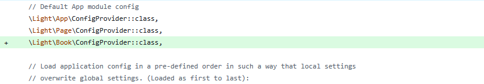

# Entities and Migrations

In the previous tutorial we have shown you how to install the basic functionality of Doctrine.
In this tutorial we are going to show you how to make changes to the database schema through `Entities` and `Migrations`.

## What are Entities ?

In Doctrine, entities are PHP classes that represent database tables.
Each property in the class corresponds to a column in the table.
Entities define the structure and behavior of your data.

## What are Migrations ?

Doctrine migrations are version-controlled changes to the database schema.
They allow you to safely update the structure of your database (create tables, add columns, etc.) over time — similar to Git for your database.

## Setting Up the Migrations Functionality

To enable Doctrine migrations, we configure the migrations section in the `getDoctrineConfig()` function from `src/App/ConfigProvider`.
This defines `where migration files will be stored`, as well as `how the migration table is managed`.
The configuration includes settings for the migrations table, execution tracking, and the path where new migration classes will be generated.


```php
'migrations'    => [
    'table_storage' => [
        'table_name'                 => 'doctrine_migration_versions',
        'version_column_name'        => 'version',
        'version_column_length'      => 191,
        'executed_at_column_name'    => 'executed_at',
        'execution_time_column_name' => 'execution_time',
    ],
    // Modify this line based on where you would like to have your migrations
    'migrations_paths'        => [
        'Migrations' => 'src/App/src/Migration',
    ],
    'all_or_nothing'          => true,
    'check_database_platform' => true,
],
```

Along with those we also need to create the file `config/cli-config.php`.
This `cli-config.php` file sets up Doctrine so that you can run **migration commands** from the command line (CLI).
It connects the Doctrine Migrations system with your application's existing `EntityManager`.

```php
<?php

declare(strict_types=1);

use Doctrine\Migrations\Configuration\EntityManager\ExistingEntityManager;
use Doctrine\Migrations\Configuration\Migration\ConfigurationArray;
use Doctrine\Migrations\DependencyFactory;
use Doctrine\ORM\EntityManager;

$container = require 'config/container.php';

$entityManager = $container->get(EntityManager::class);
$entityManager->getEventManager();

return DependencyFactory::fromEntityManager(
    new ConfigurationArray($container->get('config')['doctrine']['migrations']),
    new ExistingEntityManager($entityManager)
);
```

## Used UUID type

In our latest releases we have decided to switch from a `binary UUID to a string UUID`.
Because of that, we are also implementing our own custom UUID type in the folder `src/App/src/DBAL/Types/UuidType.php`.
With this method we can also add our own custom types in the future.

```php
<?php

declare(strict_types=1);

namespace Light\App\DBAL\Types;

use Doctrine\DBAL\Platforms\AbstractPlatform;

class UuidType extends \Ramsey\Uuid\Doctrine\UuidType
{
    public const NAME = 'uuid';

    public function getSQLDeclaration(array $column, AbstractPlatform $platform): string
    {
        return 'UUID';
    }
}
```

## Testing Our Doctrine Migrations Configuration

For easier usage of this functionality, we will create a file `bin/doctrine-migrations`.
This will give us an easier way of executing `migrations` operations.

```php
#!/usr/bin/env php
<?php

declare(strict_types=1);

namespace Doctrine\Migrations;

require __DIR__ . '/../vendor/doctrine/migrations/bin/doctrine-migrations.php';
```

We can now call:

```shell
php bin/doctrine-migrations
```

The call should lead to a call that contains the following output:

```terminaloutput
  migrations:current                [current] Outputs the current version
  migrations:diff                   [diff] Generate a migration by comparing your current database to your mapping information.
  migrations:dump-schema            [dump-schema] Dump the schema for your database to a migration.
  migrations:execute                [execute] Execute one or more migration versions up or down manually.
  migrations:generate               [generate] Generate a blank migration class.
  migrations:latest                 [latest] Outputs the latest version
  migrations:list                   [list-migrations] Display a list of all available migrations and their status.
  migrations:migrate                [migrate] Execute a migration to a specified version or the latest available version.
  migrations:rollup                 [rollup] Rollup migrations by deleting all tracked versions and insert the one version that exists.
  migrations:status                 [status] View the status of a set of migrations.
  migrations:sync-metadata-storage  [sync-metadata-storage] Ensures that the metadata storage is at the latest version.
  migrations:up-to-date             [up-to-date] Tells you if your schema is up-to-date.
  migrations:version                [version] Manually add and delete migration versions from the version table.
```

## Creating our Entities

Now that we have set up the Doctrine Migrations, we shall now start working on our entities.

We need to create a base for our entities so that they have the same starting point.
For that, we will add a new directory `src/App/src/Entity` in which we will add an abstract class, `AbstractEntity.php`:

```php
<?php

declare(strict_types=1);

namespace Light\App\Entity;

use DateTimeImmutable;
use Doctrine\ORM\Mapping as ORM;
use Laminas\Stdlib\ArraySerializableInterface;
use Ramsey\Uuid\Uuid;
use Ramsey\Uuid\UuidInterface;

use function is_array;
use function method_exists;
use function ucfirst;

#[ORM\MappedSuperclass]
abstract class AbstractEntity implements ArraySerializableInterface
{
    #[ORM\Id]
    #[ORM\Column(name: 'id', type: 'uuid', unique: true, nullable: false)]
    protected UuidInterface $id;

    #[ORM\Column(name: 'created', type: 'datetime_immutable', nullable: false)]
    protected DateTimeImmutable $created;

    #[ORM\Column(name: 'updated', type: 'datetime_immutable', nullable: true)]
    protected ?DateTimeImmutable $updated = null;

    public function __construct()
    {
        $this->id = Uuid::uuid7();
    }

    public function getId(): UuidInterface
    {
        return $this->id;
    }

    public function setId(UuidInterface $id): static
    {
        $this->id = $id;

        return $this;
    }

    public function getCreated(): ?DateTimeImmutable
    {
        return $this->created;
    }

    public function getCreatedFormatted(string $dateFormat = 'Y-m-d H:i:s'): string
    {
        return $this->created->format($dateFormat);
    }

    public function getUpdated(): ?DateTimeImmutable
    {
        return $this->updated;
    }

    public function getUpdatedFormatted(string $dateFormat = 'Y-m-d H:i:s'): ?string
    {
        if ($this->updated instanceof DateTimeImmutable) {
            return $this->updated->format($dateFormat);
        }

        return null;
    }

    #[ORM\PrePersist]
    public function created(): void
    {
        $this->created = new DateTimeImmutable();
    }

    #[ORM\PreUpdate]
    public function touch(): void
    {
        $this->updated = new DateTimeImmutable();
    }

    /**
     * @param array<non-empty-string, mixed> $array
     */
    public function exchangeArray(array $array): void
    {
        foreach ($array as $property => $values) {
            if (is_array($values)) {
                $method = 'add' . ucfirst($property);
                if (! method_exists($this, $method)) {
                    continue;
                }
                foreach ($values as $value) {
                    $this->$method($value);
                }
            } else {
                $method = 'set' . ucfirst($property);
                if (! method_exists($this, $method)) {
                    continue;
                }
                $this->$method($values);
            }
        }
    }
}
```

We extend this class to **any Entity** that we create so that all can have an identifier(`id`), a field for knowing when it was `created` and one to mark a point in time for when we `update` it.

It is time to finally time to work on our `Book` Entity.
We now create a new module with the location `src/Book/src`.
In this module we create a directory called `Entity` in which we shall create our `Book.php` class.

```php
<?php

declare(strict_types=1);

namespace Light\Book\Entity;

use Doctrine\ORM\Mapping as ORM;
use Light\App\Entity\AbstractEntity;
use Light\Book\Repository\BookRepository;

#[ORM\Entity(repositoryClass: BookRepository::class)]
#[ORM\Table(name: 'books')]
#[ORM\HasLifecycleCallbacks]
class Book extends AbstractEntity
{
    #[ORM\Column(name: 'title', type: 'string', length: 500)]
    private string $title;

    #[ORM\Column(name: 'author', type: 'string', length: 500)]
    private string $author;

    public function getTitle(): ?string
    {
        return $this->title;
    }

    public function setTitle(string $title): void
    {
        $this->title = $title;
    }

    public function getAuthor(): ?string
    {
        return $this->author;
    }

    public function setAuthor(string $author): void
    {
        $this->author = $author;
    }

    /**
     * @return array{
     *     id: non-empty-string,
     *     title: string,
     *     author: string
     * }
     */
    public function getArrayCopy(): array
    {
        return [
            'id'     => $this->id->toString(),
            'title'  => $this->title,
            'author' => $this->author,
        ];
    }
}
```

In the book class you can see various Doctrine tags such as `#[ORM\Table(name: 'books')]` which specify the name of the table that will be related to this Entity.
There are many tags that can be added, but for the sake of simplicity, we will stick to the table and the columns that will populate it.

## Repositories

In the class we created earlier, you may have noticed that our Entity is linked to a Repository using the following annotation: `#[ORM\Entity(repositoryClass: BookRepository::class)]`.
This specifies which Repository will handle queries for this Entity.
This allows us to write custom database logic for it.

Same as for the Entities, we need to create a base and our future Repositories.
Because of that, we will create two new directories: `src/App/src/Repository` and `src/Book/src/Repository`.

Two repositories shall be created:

- `src/App/src/Repository/AbstractRepository.php`

```php
<?php

declare(strict_types=1);

namespace Light\App\Repository;

use Doctrine\ORM\EntityRepository;
use Doctrine\ORM\QueryBuilder;
use Light\App\Entity\EntityInterface;

/**
 * @extends EntityRepository<object>
 */
class AbstractRepository extends EntityRepository
{
    public function deleteResource(EntityInterface $resource): void
    {
        $this->getEntityManager()->remove($resource);
        $this->getEntityManager()->flush();
    }

    public function getQueryBuilder(): QueryBuilder
    {
        return $this->getEntityManager()->createQueryBuilder();
    }

    public function saveResource(EntityInterface $resource): void
    {
        $this->getEntityManager()->persist($resource);
        $this->getEntityManager()->flush();
    }
}
```

- `src/App/src/Book/BookRepository.php`

```php
<?php

declare(strict_types=1);

namespace Light\Book\Repository;

use Light\App\Repository\AbstractRepository;

class BookRepository extends AbstractRepository
{
    /**
     * Any other custom methods can be added here
     */
}
```

The `BookRepository.php`, for example, can implement functions that list books based on specific authors or titles.
However, this will not be covered in this chapter of the tutorial.

## Final Steps

We have 3 final steps:

- registering our `Book` module
- registering our new namespace in `composer.json`
- running the migrations

### Step 1

In order to register our new module, we need a new `ConfigProvider.php` in our `src/Book/src` folder.
In this class we configure Doctrine to know from where to get our Entities.

```php
<?php

declare(strict_types=1);

namespace Light\Book;

use Doctrine\ORM\Mapping\Driver\AttributeDriver;
use Doctrine\Persistence\Mapping\Driver\MappingDriver;

class ConfigProvider
{
    public function __invoke(): array
    {
        return [
            'doctrine' => $this->getDoctrineConfig(),
        ];
    }

    private function getDoctrineConfig(): array
    {
        return [
            'driver' => [
                'orm_default'  => [
                    'drivers' => [
                        'Light\Book\Entity' => 'BookEntities',
                    ],
                ],
                'BookEntities' => [
                    'class' => AttributeDriver::class,
                    'cache' => 'array',
                    'paths' => [__DIR__ . '/Entity'],
                ],
            ],
        ];
    }
}
```

This class should be added in `config/config.php`.



```php
\Light\Book\ConfigProvider::class,
```

### Step 2

Registering the namespace is fairly simple.
We just add it in our `composer.json` file by adding `"Light\\Book\\": "src/Book/src/"` under the `autoload`.`psr-4` key:

,

```text
"Light\\Book\\": "src/Book/src/"
```

We now have to run the following command to have it registered:

```shell
composer dump-autoload
```

The module is now registered.

### Step 3

For the last step we will create a migration using our `bin/doctrine-migrations` file and then execute it:

```shell
php bin/doctrine-migrations migrations:diff
```

You should get an output similar to:

```terminaloutput
Generated new migration class to "src/App/src/Migration/Version20251127183637.php"
```

The `migrations:diff` flag tells Doctrine to compare our current database schema and create a file in which the differences will be transformed into SQL syntax.
Inside this file you should have something similar to:

```php
final class Version20251127183637 extends AbstractMigration
{
    public function getDescription(): string
    {
        return '';
    }

    public function up(Schema $schema): void
    {
        // this up() migration is auto-generated, please modify it to your needs
        $this->addSql('CREATE TABLE books (title VARCHAR(500) DEFAULT NULL, author VARCHAR(500) DEFAULT NULL, id UUID NOT NULL, created DATETIME NOT NULL, updated DATETIME DEFAULT NULL, PRIMARY KEY (id)) DEFAULT CHARACTER SET utf8mb4');
    }

    public function down(Schema $schema): void
    {
        // this down() migration is auto-generated, please modify it to your needs
        $this->addSql('DROP TABLE books');
    }
}
```

We only have to execute the migrations now with the command:

```shell
php bin/doctrine-migrations migrations:migrate
```

The output should be similar to this:

```terminaloutput
[OK] Successfully migrated to version: Migrations\Version2025112718363
```

### Summary

- [Modified] src/App/src/ConfigProvider.php
- [+] config/cli-config.php
- [+] src/App/src/DBAL/Types/UuidType.php
- [+] bin/doctrine-migrations
- [+] src/App/src/Entity/AbstractEntity.php
- [+] src/Book/src/Entity/Book.php
- [+] src/App/src/Repository/AbstractRepository.php
- [+] src/App/src/Book/BookRepository.php
- [+] src/Book/src/ConfigProvider.php
- [Modified] config/config.php
- [Modified] composer.json
- [+] src/App/src/Migration/Version{date_time}.php
