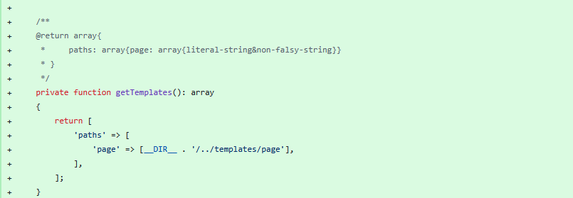
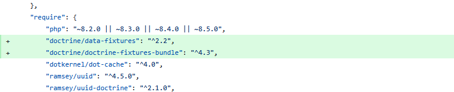
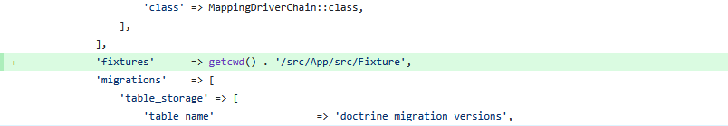
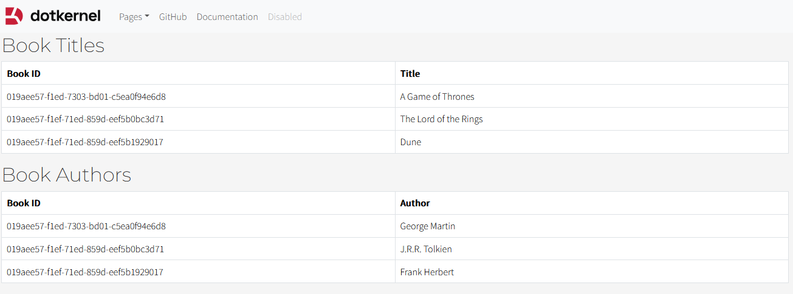

# Fixtures and Custom Listing

In the previous chapter, after we have created our Entities we have talked briefly about their related Repositories.
In this chapter we are going to have a closer look at them along with a custom listing of our books.

## Repository Logic Update

Our goal is to create two custom functions that would retrieve the titles and the authors separately from each book.
In `src/Book/src/Respository/BookRepository.php` we should add the following code:


```php
/**
 * @return array<int, array{id: non-empty-string, title: string}>
 */
public function getTitles(): array
{
    $qb = $this->getQueryBuilder()
        ->select('book.id, book.title')
        ->from(Book::class, 'book');

    return $qb->getQuery()->getResult();
}

/**
 * @return array<int, array{id: non-empty-string, author: string}>
 */
public function getAuthors(): array
{
    $qb = $this->getQueryBuilder()
        ->select('book.id, book.author')
        ->from(Book::class, 'book');

    return $qb->getQuery()->getResult();
}
```

The functions listed above will **retrieve** the `title`/`author` along with the `ID` of the Book database row for reference.

## Setting up the Route

We will now work on setting up the route from our new module through which we will display our data.
For this tutorial our route will be `{{base_url}}/books`.

In order to register this path we need to create a `RoutesDelegator.php` file in `src/Book/src`.

```php
<?php

declare(strict_types=1);

namespace Light\Book;

use Light\Book\Handler\GetBooksHandler;
use Mezzio\Application;
use Psr\Container\ContainerInterface;

use function assert;

class RoutesDelegator
{
    public function __invoke(ContainerInterface $container, string $serviceName, callable $callback): Application
    {
        $app = $callback();
        assert($app instanceof Application);

        $app->get('/books', [GetBooksHandler::class], 'books::list');

        return $app;
    }
}
```

## Handling the Request

Now that the route is exists, we need to create the class that will handle our request.
Create a new directory `src/Book/src/Handler` and create the file `GetBooksHandler.php`.

```php
<?php

declare(strict_types=1);

namespace Light\Book\Handler;

use Laminas\Diactoros\Response\HtmlResponse;
use Light\Book\Repository\BookRepository;
use Mezzio\Template\TemplateRendererInterface;
use Psr\Http\Message\ResponseInterface;
use Psr\Http\Message\ServerRequestInterface;
use Psr\Http\Server\RequestHandlerInterface;

class GetBooksHandler implements RequestHandlerInterface
{
    public function __construct(
        protected TemplateRendererInterface $template,
        protected BookRepository $bookRepository,
    ) {
    }

    public function handle(ServerRequestInterface $request): ResponseInterface
    {
        $titles  = $this->bookRepository->getTitles();
        $authors = $this->bookRepository->getAuthors();

        return new HtmlResponse(
            $this->template->render('page::books', [
                'titles'  => $titles,
                'authors' => $authors,
            ])
        );
    }
}
```

The custom functions that we have created in the `BookRepository.php` retrieve our desired values and pass it to the `books` HTML template that is being rendered.
We will crate the HTML file in the next part of this chapter.

## HTML Template for Book Listing

The `books` HTML template is currently missing, we now need to create it under the following path: `src/Book/src/templates/page/books.html.twig`.

```html


Books


    <div class="container">
        <h2>Book Titles</h2>
        <table class="table table-bordered" style="table-layout: fixed;">
            <thead>
            <tr>
                <th>Book ID</th>
                <th>Title</th>
            </tr>
            </thead>
            <tbody>
            
                <tr>
                    <td>{{ title.id }}</td>
                    <td>{{ title.title }}</td>
                </tr>
            
            </tbody>
        </table>

        <h2>Book Authors</h2>
        <table class="table table-bordered" style="table-layout: fixed;">
            <thead>
            <tr>
                <th>Book ID</th>
                <th>Author</th>
            </tr>
            </thead>
            <tbody>
            
                <tr>
                    <td>{{ author.id }}</td>
                    <td>{{ author.author }}</td>
                </tr>
            
            </tbody>
        </table>
    </div>

```

## Registering our Changes

Now that our route, handler, repository methods and view are ready, we need to **register them so the application can use them**.
In `src/Book/src/ConfigProvider.php` we need to add the following changes:




```php
public function __invoke(): array
{
    return [
        'dependencies' => $this->getDependencies(),
        'doctrine'     => $this->getDoctrineConfig(),
        'templates'    => $this->getTemplates(),
    ];
}

private function getDependencies(): array
{
    return [
        'delegators' => [
            Application::class => [
                RoutesDelegator::class,
            ],
        ],
        'factories'  => [
            GetBooksHandler::class => BookHandlerFactory::class,
            BookRepository::class  => BookRepositoryFactory::class,
        ],
    ];
}

/**
@return array{
 *     paths: array{page: array{literal-string&non-falsy-string}}
 * }
 */
private function getTemplates(): array
{
    return [
        'paths' => [
            'page' => [__DIR__ . '/../templates/page'],
        ],
    ];
}
```

In Dotkernel (and Mezzio/Laminas in general), most classes cannot be created directly with new ClassName() because they require dependencies (such as the template engine or a repository).
To provide those dependencies, we create Factory classes.

A factory’s only responsibility is to build an object with everything it needs.
For that, we have created two factories - one for our Handler and one for our Repository.

`src/App/src/Factory/BookHandlerFactory.php`:

```php
<?php

declare(strict_types=1);

namespace Light\App\Factory;

use Light\Book\Handler\GetBooksHandler;
use Light\Book\Repository\BookRepository;
use Mezzio\Template\TemplateRendererInterface;
use Psr\Container\ContainerExceptionInterface;
use Psr\Container\ContainerInterface;
use Psr\Container\NotFoundExceptionInterface;

use function assert;

class BookHandlerFactory
{
    /**
     * @throws ContainerExceptionInterface
     * @throws NotFoundExceptionInterface
     */
    public function __invoke(ContainerInterface $container, string $requestedName): GetBooksHandler
    {
        $repository = $container->get(BookRepository::class);
        $template   = $container->get(TemplateRendererInterface::class);

        assert($repository instanceof BookRepository);
        assert($template instanceof TemplateRendererInterface);

        return new GetBooksHandler($template, $repository);
    }
}
```

`src/App/src/Factory/BookRepositoryFactory.php`:

```php
<?php

declare(strict_types=1);

namespace Light\App\Factory;

use Doctrine\ORM\EntityManager;
use Light\Book\Entity\Book;
use Light\Book\Repository\BookRepository;
use Psr\Container\ContainerExceptionInterface;
use Psr\Container\ContainerInterface;
use Psr\Container\NotFoundExceptionInterface;

use function assert;

class BookRepositoryFactory
{
    /**
     * @throws ContainerExceptionInterface
     * @throws NotFoundExceptionInterface
     */
    public function __invoke(ContainerInterface $container): BookRepository
    {
        $entityManager = $container->get(EntityManager::class);

        $repository = $entityManager->getRepository(Book::class);
        assert($repository instanceof BookRepository);

        return $repository;
    }
}
```

All the changes are now registered.

## Populating the Table

In order to have values for us to display, we now have to populate our `books` table from our database with some values.
There are two options in this case:

- Use Doctrine Fixtures
- Add entries manually from the Database Client.

**We recommend using fixtures**, but if you choose the alternative approach, feel free to skip directly to the **final section** of this chapter.

## Doctrine Fixtures

Doctrine Fixtures are tools that let us preload sample data into the database.
They make it easy to populate entities automatically, so we can test and develop our application without adding data manually.

Our first step is to add our required Doctrine packages to our `composer.json` file:



```text
"doctrine/data-fixtures": "^2.2",
"doctrine/doctrine-fixtures-bundle": "^4.3",
```

After importing our packages, we need to register the path for our Fixture files in `src/App/src/ConfigProvider.php`.



```php
'fixtures' => getcwd() . '/src/App/src/Fixture',
```

We now need to create our Fixture Loader in `src/App/src/Fixture/BookLoader.php`:

```php
<?php

declare(strict_types=1);

namespace Light\App\Fixture;

use Doctrine\Bundle\FixturesBundle\Fixture;
use Doctrine\Persistence\ObjectManager;
use Light\Book\Entity\Book;

class BookLoader extends Fixture
{
    public function load(ObjectManager $manager): void
    {
        $book1 = new Book();
        $book1->setTitle('A Game of Thrones');
        $book1->setAuthor('George Martin');
        $manager->persist($book1);

        $book2 = new Book();
        $book2->setTitle('The Lord of the Rings');
        $book2->setAuthor('J.R.R. Tolkien');
        $manager->persist($book2);

        $book3 = new Book();
        $book3->setTitle('Dune');
        $book3->setAuthor('Frank Herbert');
        $manager->persist($book3);

        $manager->flush();
    }
}
```

For our last step we only need to create an executable for our fixtures in `bin/doctrine-fixtures`:

```php
#!/usr/bin/env php
<?php

declare(strict_types=1);

use Doctrine\Common\DataFixtures\Executor\ORMExecutor;
use Doctrine\Common\DataFixtures\Loader;
use Doctrine\Common\DataFixtures\Purger\ORMPurger;
use Doctrine\ORM\EntityManager;

require_once 'vendor/autoload.php';

$container = require 'config/container.php';

$entityManager = $container->get(EntityManager::class);
$config        = $container->get('config');

// Get fixtures directory from config
$fixturesPath = $config['doctrine']['fixtures'];

if (! is_dir($fixturesPath)) {
    echo "Fixtures directory not found: {$fixturesPath}\n";
    exit(1);
}

// Load fixtures
$loader = new Loader();
$loader->loadFromDirectory($fixturesPath);

// Execute fixtures
$purger   = new ORMPurger();
$executor = new ORMExecutor($entityManager, $purger);

echo "Loading fixtures from: {$fixturesPath}\n";

$executor->execute($loader->getFixtures());

echo "Fixtures loaded successfully!\n";
```

Now we can run:

```shell
php bin/doctrine-fixtures
```

The output should be similar to this:

```terminaloutput
Loading fixtures from: {{ your_path }}
Fixtures loaded successfully!
```

## Listing Result

In order to see your changes either go to `{{base_url}}/books` in your browser or you can add for example a button in `src/App/templates/layout/default.html`.


```html
<a class="dropdown-item" href="{{ url('books::list') }}">Books</a>
```

We should now see a page similar to the following:



### Summary

- [Modified] src/Book/src/Repository/BookRepository.php
- [+] src/Book/src/RoutesDelegator.php
- [+] src/Book/src/Handler/GetBooksHandler.php
- [+] src/Book/templates/page/books.html.twig
- [Modified] src/Book/src/ConfigProvider.php
- [+] src/App/src/Factory/BookHandlerFactory.php
- [+] src/App/src/Factory/BookRepositoryFactory.php

Fixtures (Optional):

- [Modified] composer.json
- [Modified] src/App/src/ConfigProvider.php
- [+] src/App/src/Fixture/BookLoader.php
- [+] bin/doctrine-fixtures
- [Modified] src/App/templates/layout/default.html.twig
